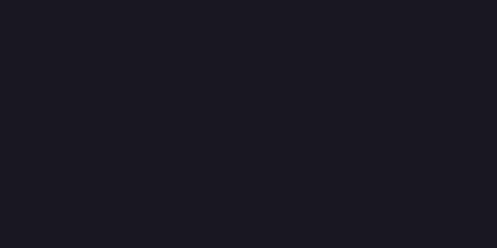

# bilibili-mcp

A content-intelligence bridge for **Bilibili (B站)**, China's largest video
platform. Search, trending, video intel and transcript summarisation - no
account needed for the core tier.

## What this wraps

[Bilibili](https://www.bilibili.com/) - the Chinese video sharing platform.
This server does **not** play video; it returns metadata, lists and subtitle
transcripts so an agent can search, rank and summarise Bilibili content.
See [docs/WRAPPEE.md](docs/WRAPPEE.md).

## Preview



## What You Can Do

### How it runs

| Mode | Host app | When |
|------|----------|------|
| **Headless / API (default)** | Bilibili public web APIs | Everything - no account, no GUI |

Bilibili is a web platform, not a local app - there is no desktop binary to
install. The server talks to Bilibili's public API over HTTPS.

### Hands-in / Hands-out

| Direction | Artifacts | Notes |
|-----------|-----------|-------|
| **Hands-in** | search keyword, Bilibili URL (BV.../av...) | `bilibili_search`, `bilibili_video` |
| **Hands-out** | metadata + stats, transcript text, comment summaries | `bilibili_video`, `bilibili_transcript` |

### Capabilities

- **Explore** - popular feed, all-region ranking, hot search keywords (anonymous)
- **Search** - videos and creators (may need a cookie to pass risk control)
- **Video intel** - metadata + stats, part list, hot comments (anonymous)
- **Transcript** - auto-subtitle text for summarisation (the killer feature)
- **Account tier** (optional) - following feed, favorites; needs a +86 login

> **Anonymous by default** - explore, video intel and transcripts work with
> zero setup. Only the account tier needs a Chinese +86 login cookie.

## Quick Install

Requirements: **uv** (Python), **Bun** (webapp). Option A (recommended):

```powershell
uv sync
uv run python -m bilibili_mcp.server --mode http --port 11185
```

Or run the full stack (backend + webapp + browser) with `start.bat` /
`start.ps1`. Backend `11185`, frontend `11186`.

> **First time?** Complete [docs/ONBOARDING.md](docs/ONBOARDING.md) before
> expecting live host calls (anonymous tier needs nothing; account tier needs
> a +86 login).

## Documentation

| Doc | What it covers |
|-----|----------------|
| [Onboarding](docs/ONBOARDING.md) | Accounts, the +86 number question, first-run setup |
| [Configuration](docs/CONFIGURATION.md) | Env vars, tiers, LLM provider |
| [Tools](docs/TOOLS.md) | Full MCP + REST reference |
| [Development](docs/DEVELOPMENT.md) | Layout, running, testing |
| [Troubleshooting](docs/TROUBLESHOOTING.md) | Symptom -> fix |
| [Wrappee](docs/WRAPPEE.md) | About the Bilibili platform |
| [SPEC](SPEC.md) | Feature spec + stage plan |

## Tier status

| Tier | Requires | Unlocks |
|------|----------|---------|
| Anonymous | nothing | explore, search, video intel, transcript |
| Account | `BILIBILI_COOKIE` (+86 login) | following feed, favorites |

## License

MIT
